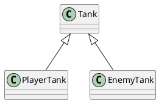

## 说明文档

## 安装typescript

- 安装
npm i -g typescript
- 编译
tsc [source]
- 生成ts默认配置文件
tsc --init
- 第三方工具
ts-node     再内存中编译，同时运行
nodemon     检测文件变化    nodemon --exec ts-node ./src/index.ts ts为扩展名的文件变化后，执行后边的命令

## 接口类型

### 扩展类型： 类型名称、枚举、接口、类

TypeScript的接口的作用： 用于约束类型，对象、函数的契约；

# 类
## 类的继承

    自类拥有父类属性
## 重写

    子类将父类重新赋值

    private protected public

    每个类拥有一个父类

# 装饰器

为属性、方法、参数、类等提供元数据信息（metadata）
元数据： 描述数据的数据

装饰器本质： 再js中，装饰器是一个函数，（装饰器是参与运行的）
可以修饰：方法、参数、类、属性