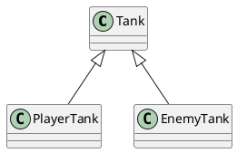

## 说明文档

## 安装typescript

- 安装
npm i -g typescript
- 编译
tsc [source]
- 生成ts默认配置文件
tsc --init
- 第三方工具
ts-node     再内存中编译，同时运行
nodemon     检测文件变化    nodemon --exec ts-node ./src/index.ts ts为扩展名的文件变化后，执行后边的命令


## 接口类型

### 扩展类型： 类型名称、枚举、接口、类

TypeScript的接口的作用： 用于约束类型，对象、函数的契约；



# 类
## 类的继承

    自类拥有父类属性
## 重写

    子类将父类重新赋值

    private protected public

    每个类拥有一个父类

#   装饰器
##  类装饰器

    为属性、方法、参数、类等提供元数据信息（metadata）
    元数据： 描述数据的数据

    装饰器本质： 再js中，装饰器是一个函数，（装饰器是参与运行的）
    可以修饰：方法、参数、类、属性
    语法：  @装饰器名

    装饰器函数 需要有一个参数
        target: function
        或
        target: new () => object

    使用装饰器需要开始这个配置
    "experimentalDecorators": true,        /* Enables experimental support for ES7 decorators. */

    装饰器运行在 *类定义之后*
    装饰器可以有返回值
        - void  仅运行
        - class 返回值为class，将会替换标记的类

    装饰器的运行顺序: ↑ 从下到上运行 ↑
            先上到下 ↓ 调用装饰器生成函数，再从下到上 ↑执行装饰器

##  成员装饰器

    - 属性
        属性装饰器也是函数,需要两个参数
        1. 如果是静态属性，则为类本身；如果为实例属性，则为类的原型
        2. 固定为一个字符串，表示属性名
##  方法装饰器
    需要三个参数
        1. 如果是静态属性，则为类本身；如果为实例属性，则为类的原型
        2. 固定为一个字符串，表示方法名
        3. 描述符对象

##  参数装饰器
    依赖注入    依赖倒置

    需要有三个参数
        1. 如果方法是静态的，则为类本身；如果是实例方法，则为类的原型
        2. 方法名称
        3. 参数的索引（装饰的是第几个参数）

##  装饰器相关库
    reflect-matedata

    class-validatot

    class-transformer

ts 自动注入元数据
    开启条件：  1. 安装了reflect-matedata  2. 某个类中使用了元数据  3. tsconfig开启了emitDecoratorMetadata
    效果：自动添加类型约束的元数据
    优势：类型约束有机会在运行时生效


# 类型演算

##  三个关键字

    1. typeof
        const a = 'asdf'; let b: typeof a = 'asdf' = 'asdf';
    2. keyof
        作用于类、接口、类型别名    得到的是所有成员名组成的联合类型
    3. in
        常与keyof联用
## Ts 预设的类型演算

```ts

Partial<T>      //  类型成员变为可选
Required<T>     //  必选        -？ 表示去掉可选
Readonly<T>     //  只读
Exclude<T, U>   //  从T中剔除可以赋值U类型的属性
Extract<T, U>   //  提取
NonNullable<T>  //  不可为null或undefined
ReturnType<T>   //  获取返回值类型      => info  表示推断
InstanceType<T> //  获取构造函数类型的实例类型

```

# 声明文件
    1. 什么是声明文件
        以```·d.ts```结尾的文件
    2. 声明文件的作用
        为js代码提供类型声明
    3. 生命文件的位置
        -   可以放在tsconfig include下的路径里
        -   node_modules/@types文件夹中
        -   手动配置  tsconfig.typesRoots :[]   会导致前两个默认的位置失效
        -   与js代码所在目录相同，且文件名也相同对文件  test.js + test.d.ts
    3. 编写
        -   **自动生成**
            配置    tsconfig.declaration: true
            适用于ts编写的代码
        -   **手动编写**
            对已有的js书写的库，手动编写声明文件
    4. 三斜线指令
        -   /// <reference path="../../index.d.ts" />
    5. 发布
        发布到  @types/***
        -   进入DefinitelyTyped
        -   fork
        -   clone
        -   新建分支（mylodash4.3）,在新分支中进行声明文件的开发
            在types中新建文件夹开发
        -   push
        -   在官放类型库，提交pull request
        -   等待审核
        之后就可以通过命令  ```npm install @types/***```

